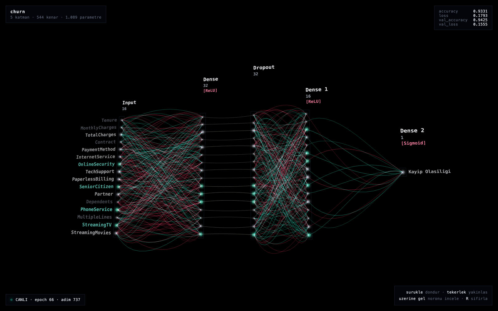
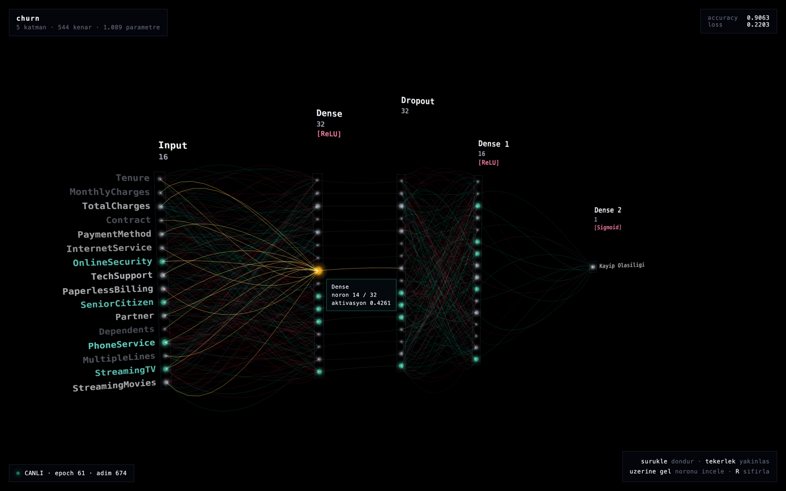
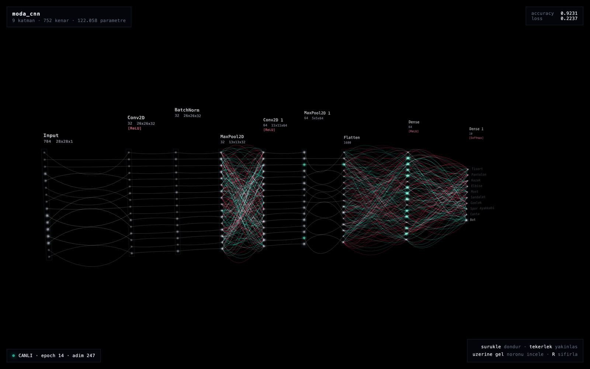
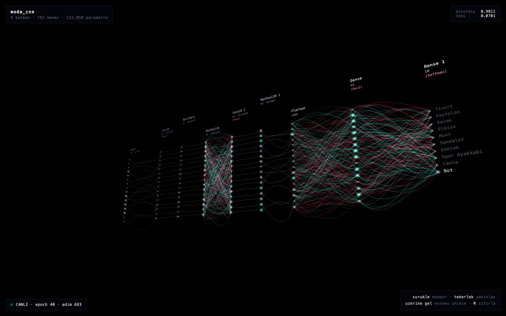

# nn3d

Watch neural networks train in **live 3D** in your browser. Every layer's activation and every connection's weight stream in real time.

```python
import nn3d

nn3d.show(model)                                       # opens browser
model.fit(X, y, callbacks=[nn3d.Monitor(X[:1])])       # training streams live
```

In a notebook, nothing else is needed. In a plain `.py` script the process exits when the script finishes — add `nn3d.wait()` at the end to keep the server alive.



## Screenshots

Every image below is a real capture of the viewer while a Keras model was actually training — note the `CANLI · epoch N · adim N` badge in the bottom-left corner and the metrics ticking in the top-right.

**Hover a neuron** — its connections light up in gold, everything else dims, and the tooltip reports the *real* neuron index behind the drawn subset:



**A CNN** — `Conv2D → BatchNorm → MaxPool → Conv2D → MaxPool → Flatten → Dense → Softmax` on Fashion-MNIST. Each card shows the layer's tensor shape (`26x26x32`), and the `784` and `1600` layers are drawn as 16 representative neurons each:



**Drag to orbit** — the scene is real 3D, so the layer planes separate in depth as you rotate:



## Installation

```bash
pip install nn3d
```

Node.js is **not required** — the 3D viewer ships pre-built inside the package. Node is only needed if you want to modify the viewer itself.

## What you see

- **Layer cards** — name, neuron/channel count, tensor shape, activation like `[ReLU]`
- **Neurons** — brightness and size reflect the current activation value
- **Connections** — teal = positive weight, red = negative; brightness = `|weight|` × source activation
- **Input/output labels** — feature names ("Hunger Level", "Fox Distance") color-shift with activation
- **Hover** — hovering a neuron highlights all its connections in gold, dims the rest
- **Metrics** — `loss`, `accuracy`, `val_loss`… live in the top-right corner

## API

### `nn3d.show(model, ...)`

Builds the graph and opens a browser tab. Returns a `View`.

| parameter | description |
|---|---|
| `sample` | if provided, sends the first frame immediately so the screen isn't blank |
| `input_labels` | names for the input neurons (your feature column names) |
| `output_labels` | names for the output neurons (your class names) |
| `max_neurons` | points drawn per layer (default 16) |
| `port` | default 8092; falls back to a free port automatically |
| `open_browser` | set `False` to print the URL without opening a tab |

### `nn3d.Monitor(sample, every=20, ...)`

A Keras callback. Drop it into `model.fit(callbacks=[...])`.

`every` sends a frame every N batches. Running an extra forward pass every single batch adds measurable overhead; every 20 looks smooth and costs almost nothing.

### `View.update(x, metrics=..., epoch=...)`

For custom training loops (RL, manual gradient steps) — push a frame manually.

## Virtualization — is what you see real?

Yes, but **not all of it**. Drawing `Dense(3072)` as 3 072 points means 2.3 million edges to the previous layer — the browser would freeze.

Instead, `max_neurons` evenly-spaced **representative** neurons are selected per layer; activations and weights are sliced to the same indices. Every point and every line you see corresponds to a real neuron or weight — nothing is made up, it is just a subset. When you hover a neuron the tooltip shows the **real neuron index** (`neuron 1847 / 3072`) so you always know which slice you are looking at.

## Supported layers (Keras 3)

`Dense` · `Conv1D/2D/3D` · `Conv2DTranspose` · `SeparableConv2D` · `LSTM` · `GRU` ·
`SimpleRNN` · `Flatten` · `Reshape` · `Dropout` · `BatchNormalization` ·
`LayerNormalization` · `MaxPooling*` · `AveragePooling*` · `Activation` ·
`LeakyReLU` · `ReLU` · `Softmax` · `Embedding`

Weights are reduced to a `(input_units, output_units)` matrix for visualization: conv kernels are summed over spatial axes, LSTM/GRU gates are averaged. The goal is **sign and magnitude of the connection**, not numerical precision.

## Architecture

```
Keras model ──build_graph()──▶ graph dict ──┐
                                             ├─▶ stdlib HTTP + SSE ──▶ Three.js viewer
ActivationTap.read(x) ──────▶ frame (base64 f32) ┘      (:8092)         (browser)
```

- **Zero dependencies.** The server is pure Python standard library. SSE is used instead of WebSockets because the stream is one-way (Python → browser), SSE is exactly what it was designed for, works with `http.server`, and reconnects automatically on drop. WebSockets would need either an external package or a hand-written handshake — both break the "`pip install nn3d` is enough" goal.
- **The viewer knows nothing about the model** — only the schema in `src/nn3d/schema.py`. The same viewer renders a 10-neuron game agent and a 12-block Transformer. Adding support for another framework (PyTorch, Unity, JS game) means writing a new adapter, not touching the viewer.
- **Single geometry.** All edges live in one `LineSegments`, all neurons in one `Points`. Only the color buffer is updated per frame; geometry never changes.

## Modifying the viewer

```bash
cd viewer
npm install
npm run dev      # live dev server (start the Python server separately first)
npm run build    # compiles into src/nn3d/static/index.html
```

The compiled output is part of the package, so the result of `npm run build` must be committed too.

## Examples

| file | description |
|---|---|
| `examples/nn3d_baslangic.ipynb` | End-to-end guide: static view, live training, manual frame push, virtualization |
| `examples/churn_canli.py` | Plain script example (`nn3d.wait()` usage) |
| `examples/kurs/` | FNN / CNN / RNN / GAN course notebooks with nn3d integration |

```bash
PYTHONPATH=src python examples/churn_canli.py
```
